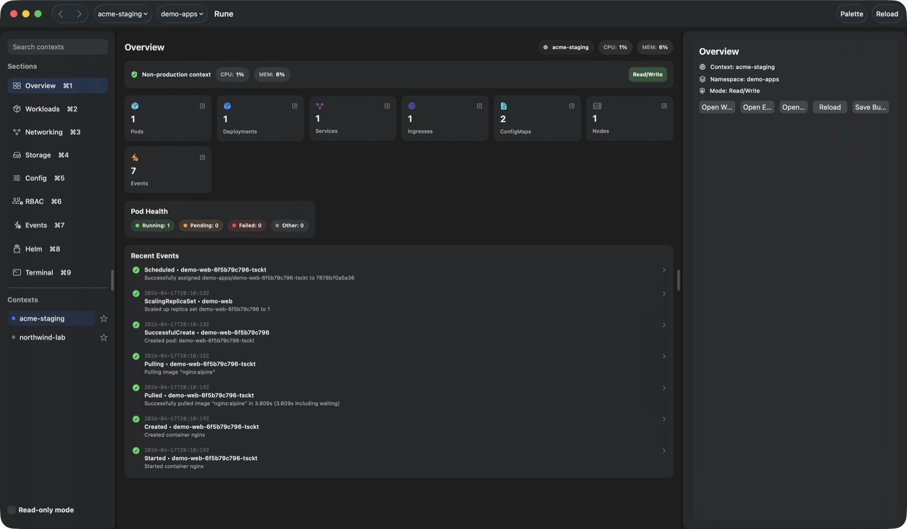
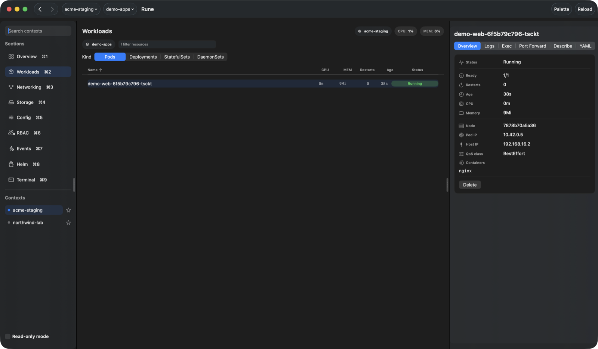
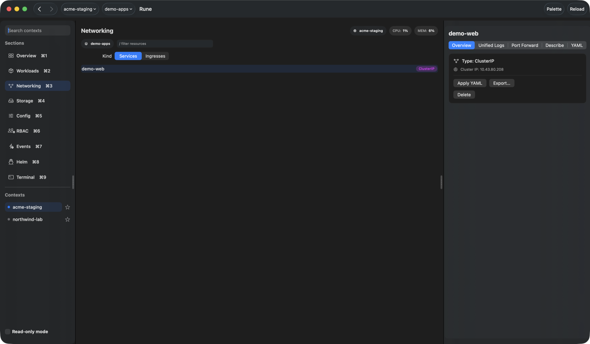
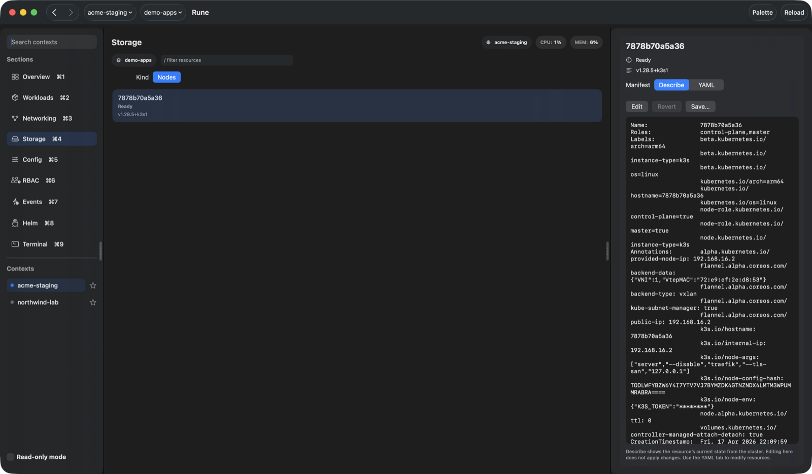
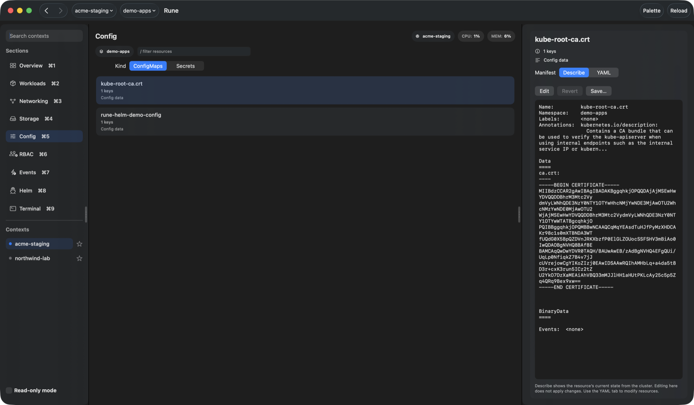
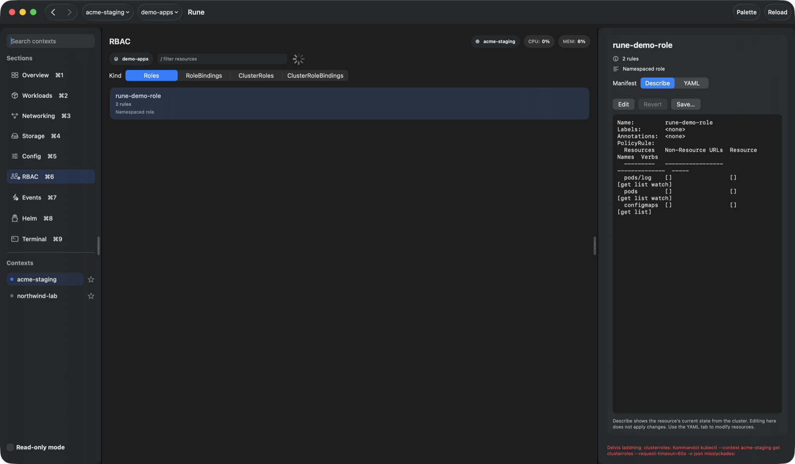
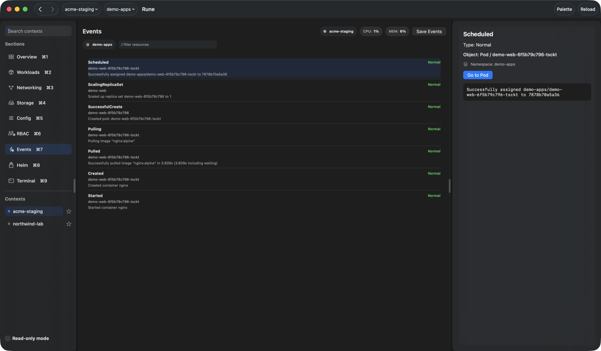
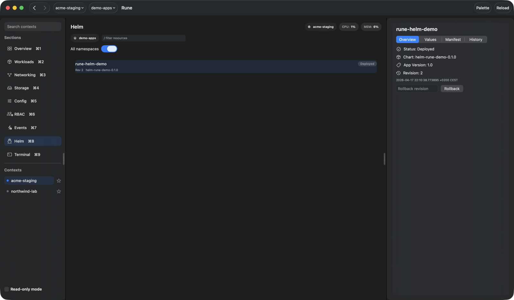
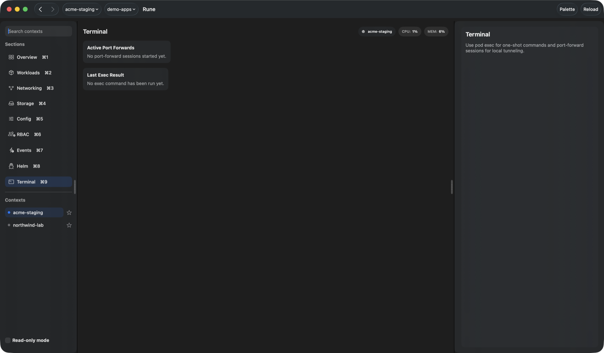
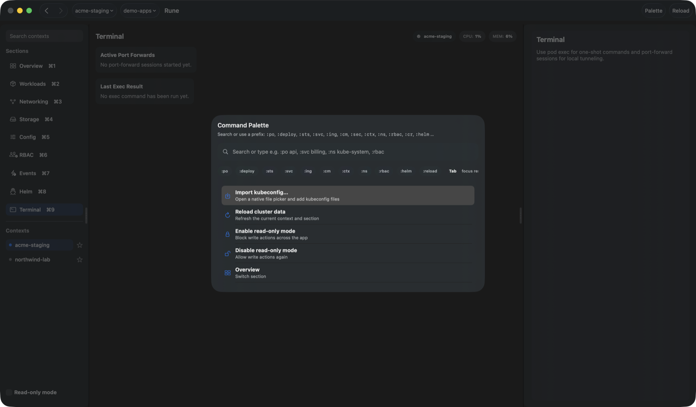

# Rune

## Overview

Rune exists so you can work with **full pod logs** and related diagnostics **without** flipping through lots of cluster or tool configuration—**capture and save** what you need in a **quick, native Swift** interface. There are no heavy embedded runtimes or slow-loading web shells: it stays a **lightweight GUI** for **debugging**, **browsing**, **editing**, **refreshing**, and routine **maintenance** across your Kubernetes clusters.

It is a **native macOS client for Kubernetes**: contexts, namespaces, resources, logs, YAML/describe, and Helm — with clear navigation and a command palette.

## Navigation

- **Main sections:** use the sidebar or **⌘1**–**⌘9** — Overview (**⌘1**), Workloads (**⌘2**), Networking (**⌘3**), Storage (**⌘4**), Config (**⌘5**), RBAC (**⌘6**), Events (**⌘7**), Helm (**⌘8**), Terminal (**⌘9**).
- **Toolbar:** choose **kube context** and **namespace** for the data you browse.
- **History:** **⌘⌥[** / **⌘⌥]** go back and forward in the navigation stack.
- **Reload:** **⌘R** refreshes the current view.

## Command palette

Open the palette with **⌘K**, or click the **Palette** button in the toolbar. You can **search** by free text (contexts, namespaces, resources, palette actions), or type a **`:`** prefix to run **commands** and narrow results.

- **Syntax:** `:command` or `:command filter` — e.g. `:po api` (pods matching “api”), `:svc billing` or `:service billing`, `:ns kube-system`. Type **`:`** alone or an unknown prefix to see a **cheat sheet** of built-in commands. If a resource list is **empty** (or nothing matches your filter), you still get a row that **opens the right view** (similar to k9s-style jumps).
- **Cluster & scope:** `:ctx` (switch context), `:ns` (switch namespace).
- **Workloads:** `:po` / `:pod` (pods), `:deploy` (deployments), `:sts` (StatefulSets), `:ds` (DaemonSets). Use `:wl` to jump between workload resource kinds in the Workloads section. **`:cj` / `:cronjob`** and **`:job` / `:jo`** are recognized but Rune does not list those resources yet—they navigate to **Workloads** (use **kubectl** for Jobs/CronJobs until supported).
- **Networking:** `:svc` / `:service` / `:services` (Services), `:ing` (Ingresses). Use `:net` to pick a networking resource kind. **`:ep` (Endpoints)** and **`:np` / `:netpol` (NetworkPolicies)** open the closest existing view with a “not in Rune yet” hint.
- **Storage:** **`:no` / `:node` / `:nodes`** (Nodes). **`:pvc`**, **`:pv`**, **`:sc` (StorageClass)** open **Storage** with a stub hint—full PVC/PV/SC browsing is not implemented yet.
- **Configuration:** `:cm` (ConfigMaps), `:sec` (Secrets). Use `:cfg` to pick a config resource kind.
- **RBAC:** `:rbac` (choose RBAC kind), `:role`, `:rb` (RoleBindings), `:cr` (ClusterRoles), `:crb` (ClusterRoleBindings). **`:sa` (ServiceAccounts)** opens RBAC with a stub hint.
- **More:** `:ev` (events), `:helm` / `:hr` (Helm releases), `:reload`, `:import` (import kubeconfig), `:ro` / `:readonly` (read-only mode). In the palette, **Tab** moves focus to the result list so you can pick an item with the keyboard.

## Screenshots

### Overview



### Workloads



### Networking



### Storage



### Configuration



### RBAC



### Events



### Helm



### Terminal



### Command palette



## Requirements

- macOS 14 or later  
- Swift 6 (e.g. via Xcode)  
- `kubectl` on your `PATH` when the app talks to a cluster  

## Build and run

```bash
swift build
swift run RuneApp
```

Release:

```bash
swift build -c release --product RuneApp
```

## App bundle

```bash
./scripts/build-macos-app.sh
```

Produces `dist/Rune.app`.

## Development

```bash
swift test
```
