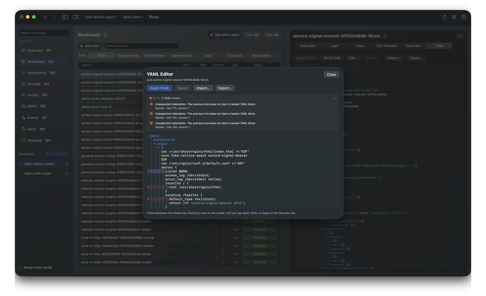
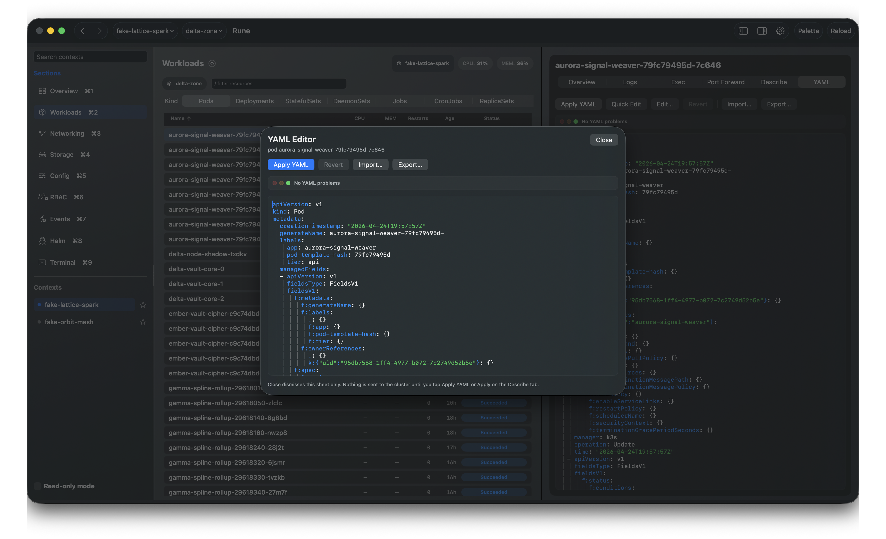
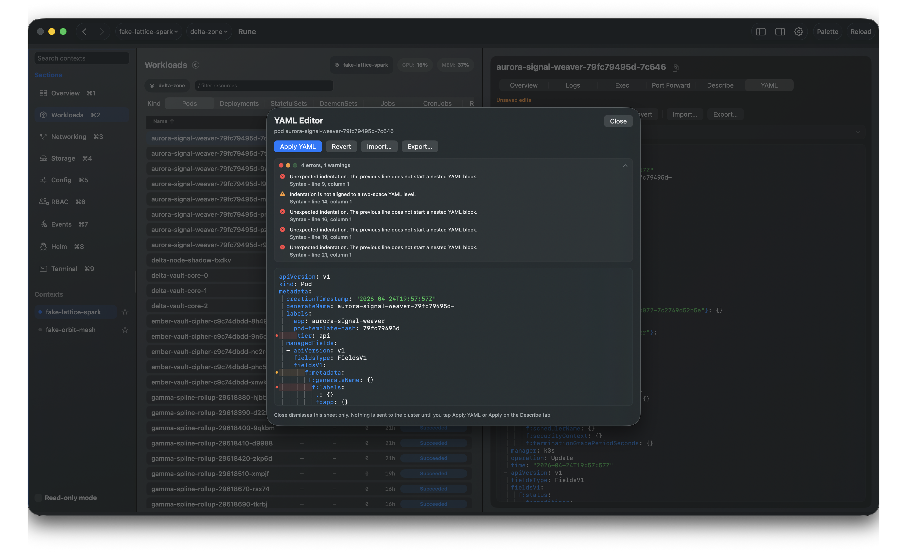
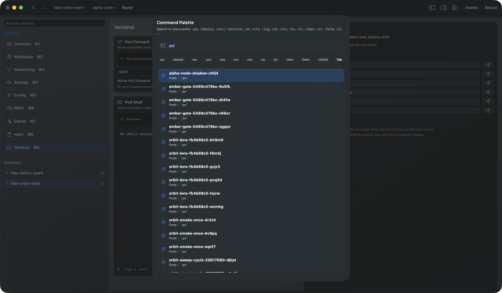
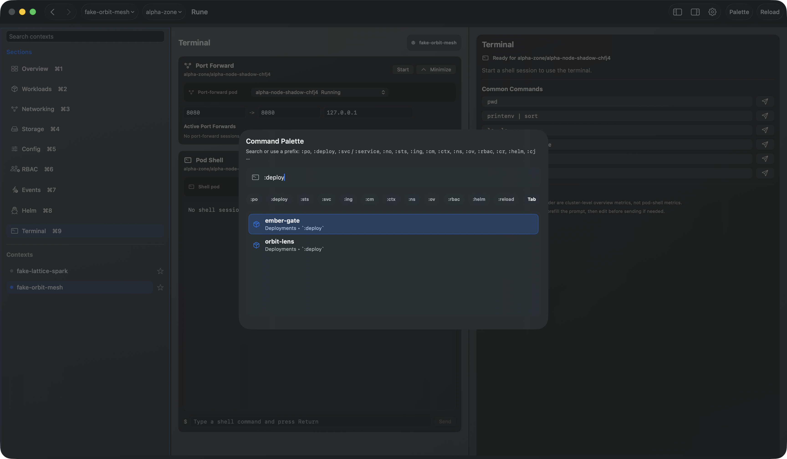
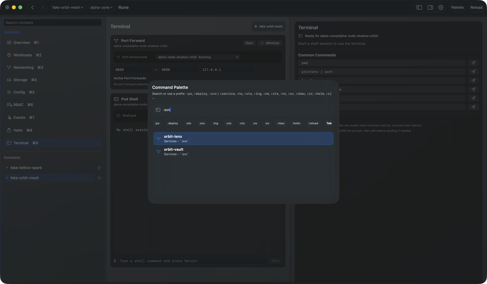
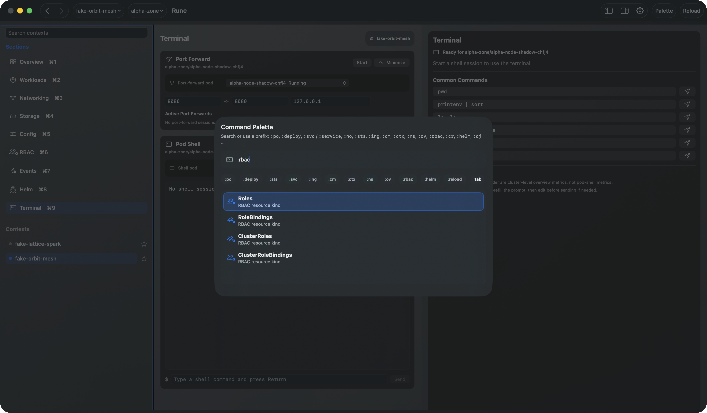
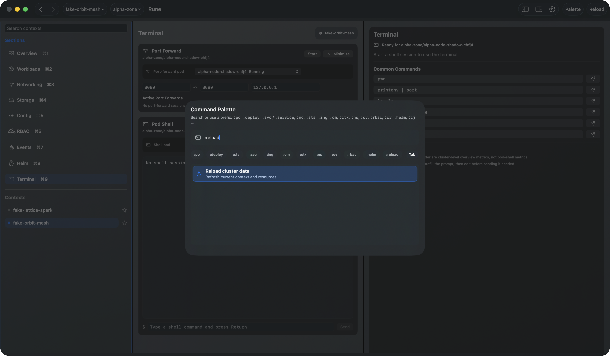

# Rune

Rune is a fast native macOS Kubernetes cluster manager for people who debug real clusters every day.

It is built for fast Kubernetes troubleshooting: quick navigation, strong keyboard support, direct access to resources, and no heavy platform console in the way. Rune adds a native macOS interface with more room for logs, YAML, describe output, port-forwarding, metrics, events, and focused troubleshooting without turning into bloat.


## Why Rune

Kubernetes debugging is often about keeping enough context in view: the pod, its controller, related service, current YAML, recent events, and the logs that actually contain the error. Rune keeps those workflows close together.

- Browse contexts, namespaces, workloads, networking, storage, config, RBAC, events, Helm releases, and a terminal view.
- Inspect full pod logs and unified logs across related workloads.
- Search through multi-pod logs without constantly changing log limits or jumping between panes.
- Edit YAML with syntax highlighting plus validation feedback for errors and warnings.
- Port-forward pods and services from the resource you are already inspecting.
- Open exec and terminal workflows in context.
- Check pod and node metrics when your cluster exposes metrics.
- Move quickly with a command palette and k9s-style resource jumps.
- Stay local: Rune does not use analytics, tracking, advertising, or telemetry.

## Screenshots

### Resource Views

<table>
  <tr>
    <td width="50%">
      
    </td>
    <td width="50%">
      
    </td>
  </tr>
  <tr>
    <td width="50%">
      
    </td>
    <td width="50%">
      
    </td>
  </tr>
  <tr>
    <td width="50%">
      
    </td>
    <td width="50%">
      
    </td>
  </tr>
  <tr>
    <td width="50%">
      
    </td>
    <td width="50%">
      
    </td>
  </tr>
  <tr>
    <td width="50%">
      
    </td>
    <td width="50%">
      
    </td>
  </tr>
  <tr>
    <td width="50%">
      
    </td>
    <td width="50%">
      
    </td>
  </tr>
  <tr>
    <td width="50%">
      
    </td>
    <td width="50%">
      
    </td>
  </tr>
  <tr>
    <td width="50%">
      
    </td>
    <td width="50%">
      
    </td>
  </tr>
  <tr>
    <td width="50%">
      
    </td>
    <td width="50%">
      
    </td>
  </tr>
  <tr>
    <td width="50%">
      
    </td>
    <td width="50%">
      
    </td>
  </tr>
  <tr>
    <td width="50%">
      
    </td>
    <td width="50%">
      
    </td>
  </tr>
  <tr>
    <td width="50%">
      
    </td>
    <td width="50%"></td>
  </tr>
</table>

### YAML Editing

<table>
  <tr>
    <td width="50%">
      
    </td>
    <td width="50%">
      
    </td>
  </tr>
  <tr>
    <td width="50%">
      
    </td>
    <td width="50%">
      
    </td>
  </tr>
</table>

### Command Palette

<table>
  <tr>
    <td width="50%">
      
    </td>
    <td width="50%">
      
    </td>
  </tr>
  <tr>
    <td width="50%">
      
    </td>
    <td width="50%">
      
    </td>
  </tr>
  <tr>
    <td width="50%">
      
    </td>
    <td width="50%">
      
    </td>
  </tr>
</table>

## Navigation

- **Main sections:** use the sidebar or **Cmd+1** through **Cmd+9**: Overview, Workloads, Networking, Storage, Config, RBAC, Events, Helm, and Terminal.
- **Toolbar:** choose the Kubernetes context and namespace for the data you browse.
- **History:** use **Cmd+Option+[** and **Cmd+Option+]** to move back and forward in the navigation stack.
- **Reload:** use **Cmd+R** to refresh the current view.

## Command Palette

Open the palette with **Cmd+K**, or click the **Palette** button in the toolbar. Search by free text across contexts, namespaces, resources, and actions, or type a `:` prefix to run command-style jumps.

- **Syntax:** `:command` or `:command filter`, for example `:po api`, `:svc billing`, or `:ns kube-system`.
- **Cluster and scope:** `:ctx` switches context and `:ns` switches namespace.
- **Workloads:** `:po` / `:pod`, `:deploy`, `:sts`, `:ds`, and `:wl`.
- **Networking:** `:svc` / `:service` / `:services`, `:ing`, and `:net`.
- **Configuration:** `:cm`, `:sec`, and `:cfg`.
- **RBAC:** `:rbac`, `:role`, `:rb`, `:cr`, and `:crb`.
- **Helm:** `:helm` / `:hr` opens Helm releases and can filter by release name.
- **More:** `:ev`, `:reload`, `:import`, `:ro`, and `:readonly`.

Type `:` by itself to see the built-in command cheat sheet.

## Privacy

Rune does not collect personal data or usage data. It does not use analytics, tracking, advertising, or telemetry, and it does not send your cluster data to a Rune backend.

The only network traffic is the traffic required for Rune to communicate with the Kubernetes clusters and services you choose to connect to.

## Requirements

- macOS 14 or later
- Swift 6, for example via Xcode
- Rune talks to Kubernetes through its native in-app Kubernetes client.

## Build and Run

```bash
swift build
swift run RuneApp
```

Release build:

```bash
swift build -c release --product RuneApp
```

## App Bundle

```bash
./scripts/build-macos-app.sh
```

Produces `dist/Rune.app`.

## Development

```bash
swift test
```

## License

Rune is source-available. Personal and other non-commercial use is free.
Business use requires a separate paid commercial license. See [LICENSE](LICENSE).
