# Rune

Rune is a fast native macOS Kubernetes cluster manager for people who debug real clusters every day.

It is built for fast Kubernetes troubleshooting: quick navigation, strong keyboard support, direct access to resources, and no heavy platform console in the way. Rune adds a native macOS interface with more room for logs, YAML, describe output, port-forwarding, metrics, events, and focused troubleshooting without turning into bloat.


## Why Rune

Kubernetes debugging is often about keeping enough context in view: the pod, its controller, related service, current YAML, recent events, and the logs that actually contain the error. Rune keeps those workflows close together.

- Browse contexts, namespaces, workloads, networking, storage, config, RBAC, events, Helm releases, and a terminal view.
- Inspect full pod logs and unified logs across related workloads.
- Search through multi-pod logs without constantly changing log limits or jumping between panes.
- Edit YAML with syntax highlighting plus validation feedback for errors and warnings.
- Port-forward pods and services from the resource you are already inspecting.
- Open exec and terminal workflows in context.
- Check pod and node metrics when your cluster exposes metrics.
- Move quickly with a command palette and k9s-style resource jumps.
- Stay local: Rune does not use analytics, tracking, advertising, or telemetry.

## Support Rune

If you want to support Rune development, buy the app on the Mac App Store:

- [Buy RuneApp on the Mac App Store](https://apps.apple.com/us/app/runeapp/id6762515322?mt=12)

You can also support development through PayPal:

- [Send 10 SEK](https://paypal.me/viktornyberg1/10SEK)
- [Send 19 SEK](https://paypal.me/viktornyberg1/19SEK)
- [Send 49 SEK](https://paypal.me/viktornyberg1/49SEK)

## Screenshots

### Overview


### Workloads


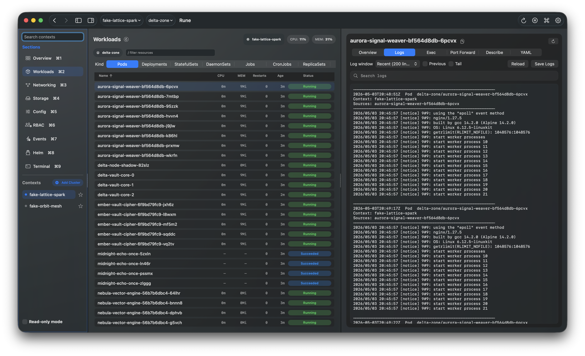

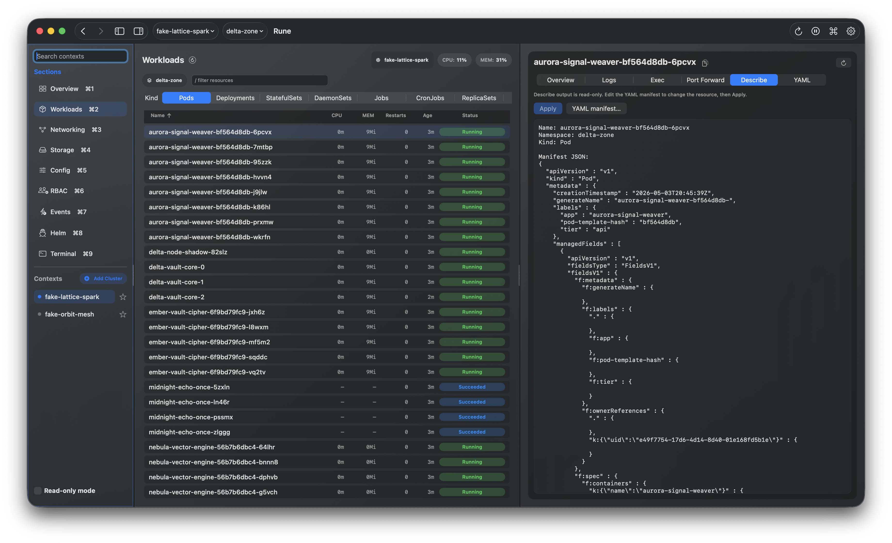


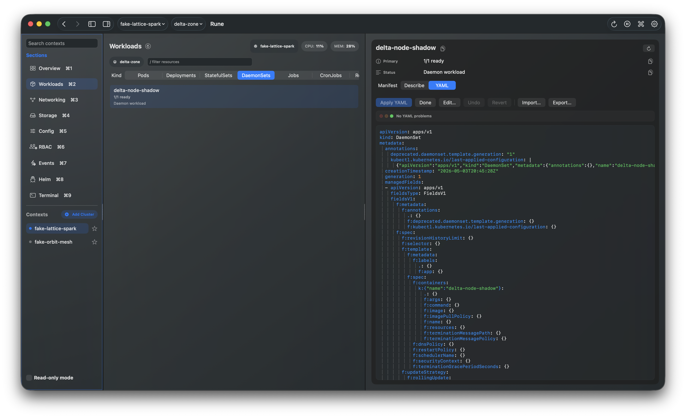


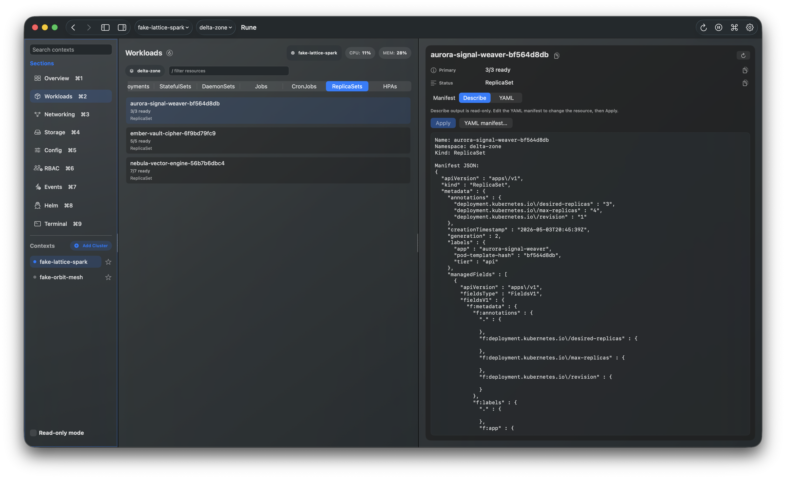

### YAML Editing And Validation


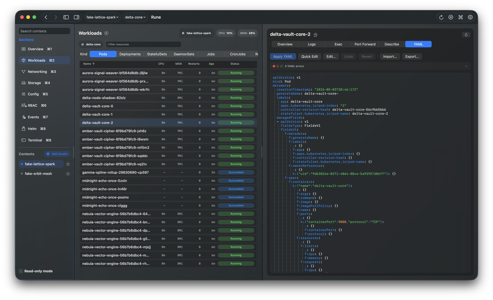

### Networking


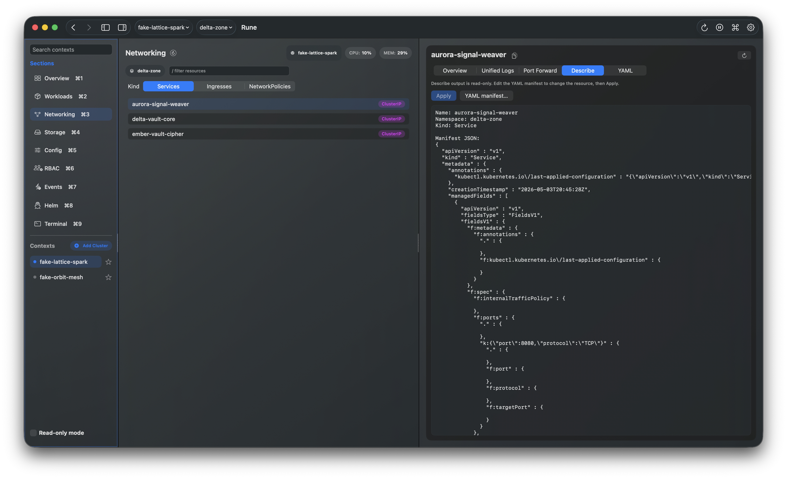

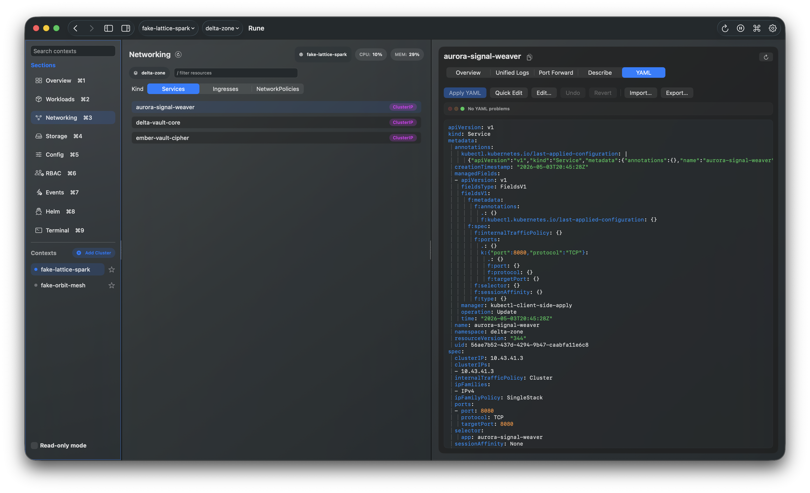


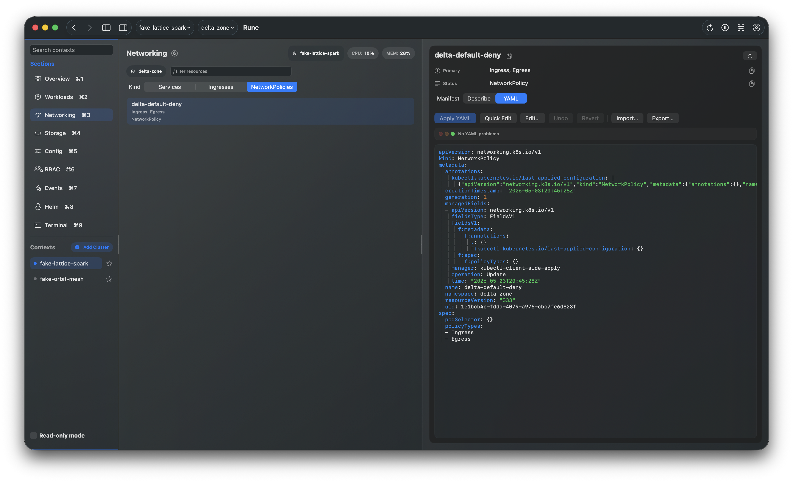

### Config, Storage, RBAC, Helm, And Events


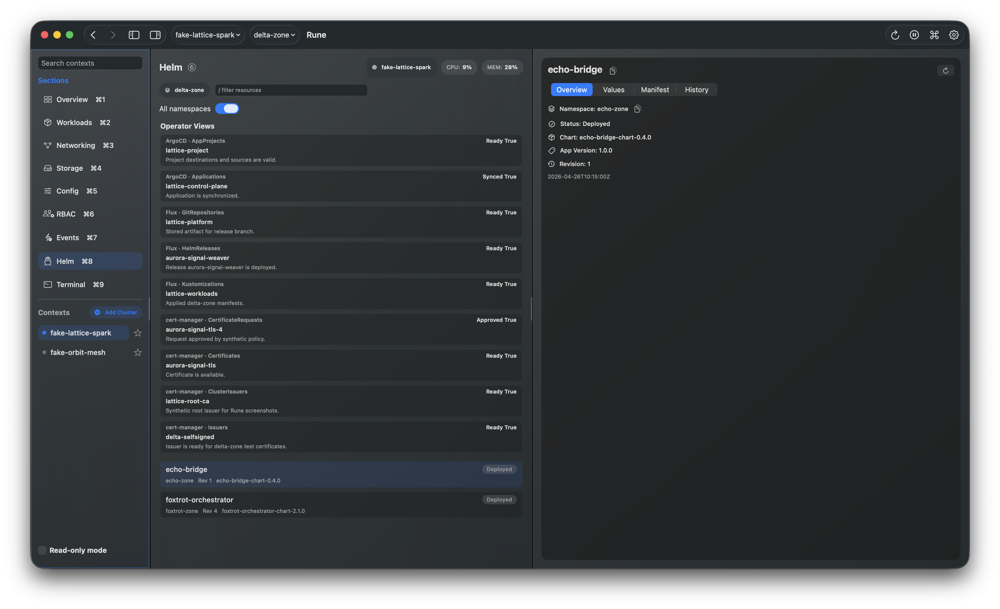


### Terminal And Port Forwarding


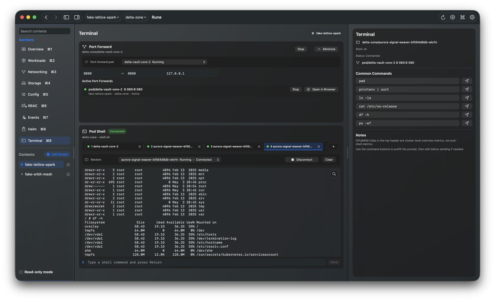

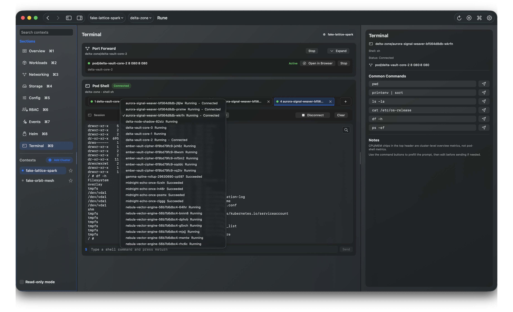

### Command Palette


## Navigation

- **Main sections:** use the sidebar or **Cmd+1** through **Cmd+9**: Overview, Workloads, Networking, Storage, Config, RBAC, Events, Helm, and Terminal.
- **Toolbar:** choose the Kubernetes context and namespace for the data you browse.
- **History:** use **Cmd+Option+Left Arrow** and **Cmd+Option+Right Arrow** to move back and forward in the navigation stack.
- **Reload:** use **Cmd+R** to refresh the current view.

## Command Palette

Open the palette with **Cmd+K**, or click the **Palette** button in the toolbar. Search by free text across contexts, namespaces, resources, and actions, or type a `:` prefix to run command-style jumps.

- **Syntax:** `:command` or `:command filter`, for example `:po api`, `:svc billing`, or `:ns kube-system`.
- **Cluster and scope:** `:ctx` switches context and `:ns` switches namespace.
- **Workloads:** `:po` / `:pod`, `:deploy`, `:sts`, `:ds`, and `:wl`.
- **Networking:** `:svc` / `:service` / `:services`, `:ing`, and `:net`.
- **Configuration:** `:cm`, `:sec`, and `:cfg`.
- **RBAC:** `:rbac`, `:role`, `:rb`, `:cr`, and `:crb`.
- **Helm:** `:helm` / `:hr` opens Helm releases and can filter by release name.
- **More:** `:ev`, `:reload`, `:import`, `:ro`, and `:readonly`.

Type `:` by itself to see the built-in command cheat sheet.

## Privacy

Rune does not collect personal data or usage data. It does not use analytics, tracking, advertising, or telemetry, and it does not send your cluster data to a Rune backend.

The only network traffic is the traffic required for Rune to communicate with the Kubernetes clusters and services you choose to connect to. Kubeconfig files, cluster endpoints, credentials, Keychain items, and security-scoped bookmarks are handled locally on your Mac.

See [PRIVACY.md](PRIVACY.md) for the full privacy policy.

## Requirements

- macOS 14 or later
- Swift 6, for example via Xcode
- Rune talks to Kubernetes through its native in-app Kubernetes client.

## Build and Run

```bash
swift build
swift run RuneApp
```

Release build:

```bash
swift build -c release --product RuneApp
```

## App Bundle

```bash
./scripts/build-macos-app.sh
```

Produces `dist/Rune.app`.

## Development

```bash
swift test
```

## License

Rune is source-available. Personal and other non-commercial use is free.
Business use requires a paid commercial license or an authorized Mac App Store
purchase. See [LICENSE](LICENSE).
