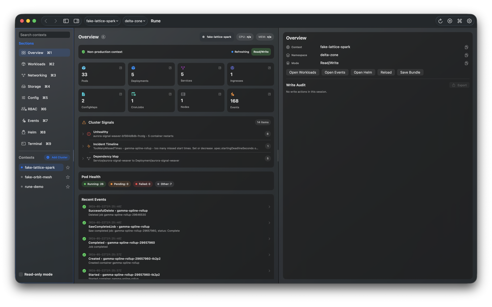
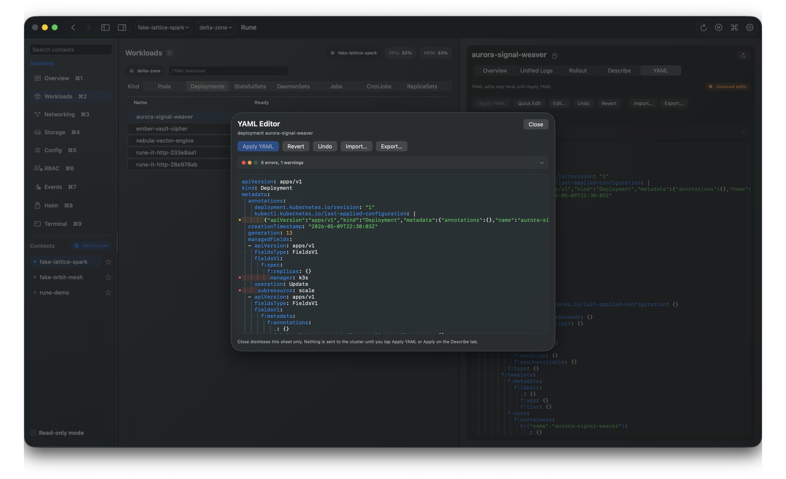
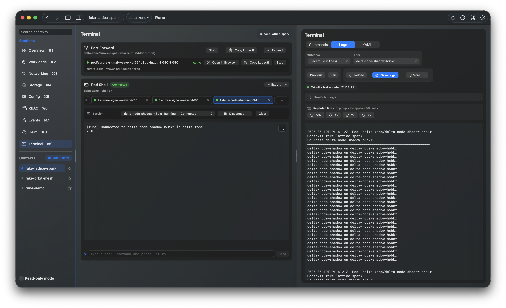
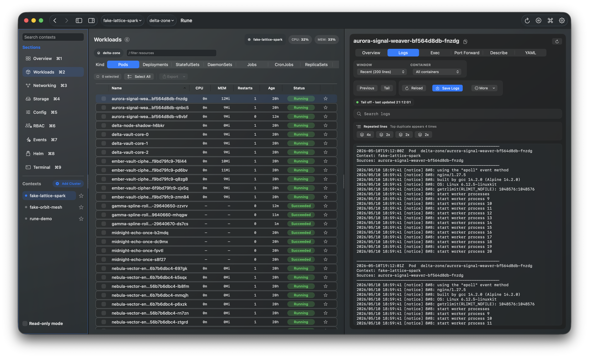
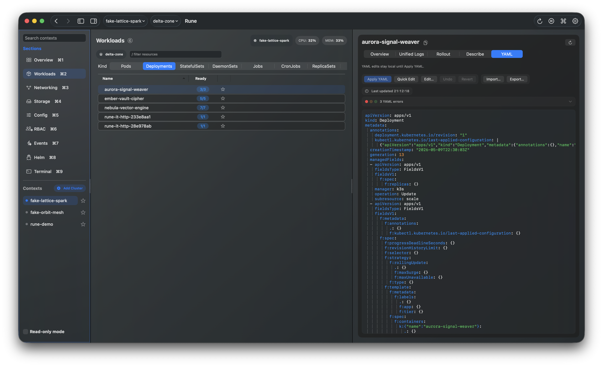
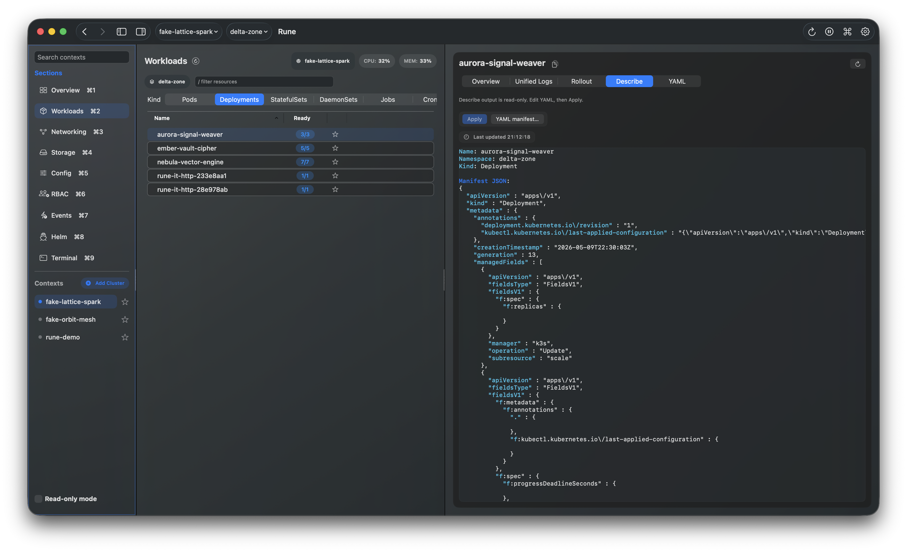
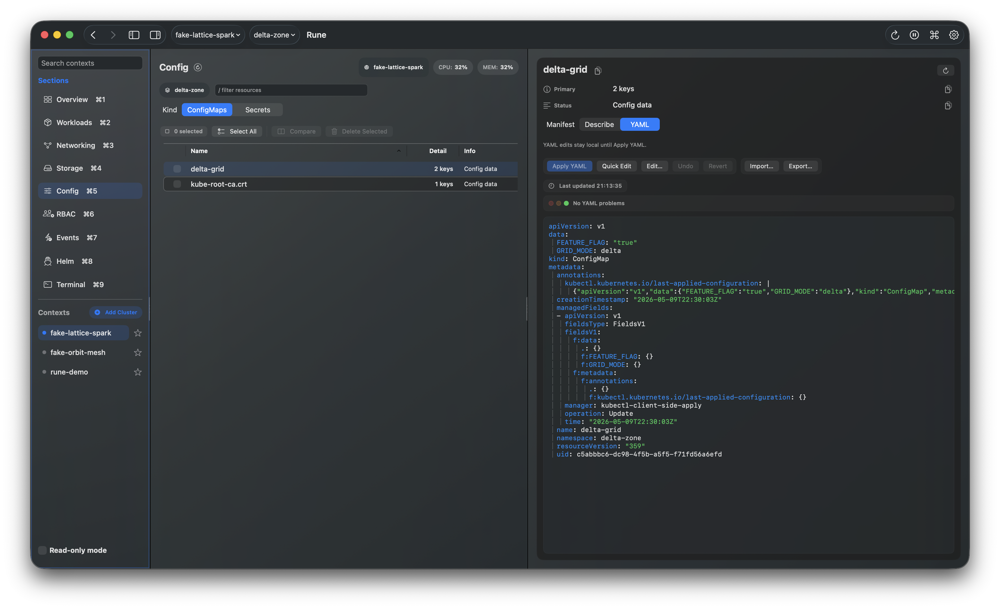
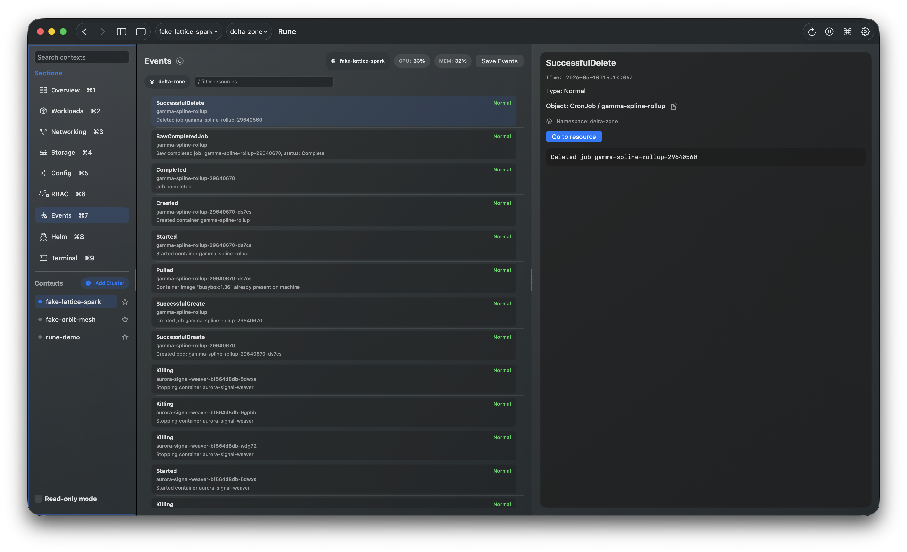
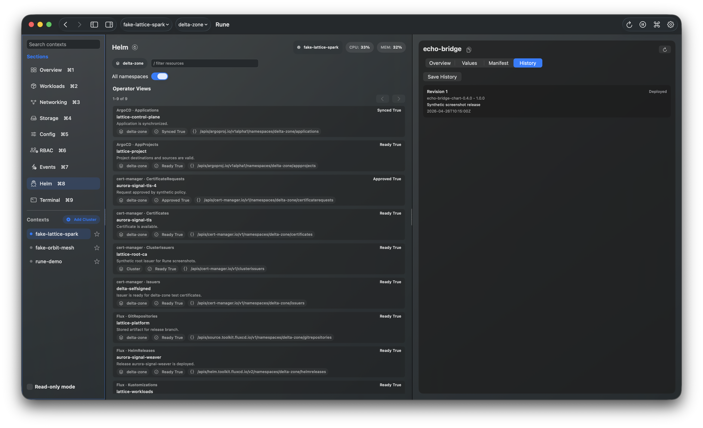
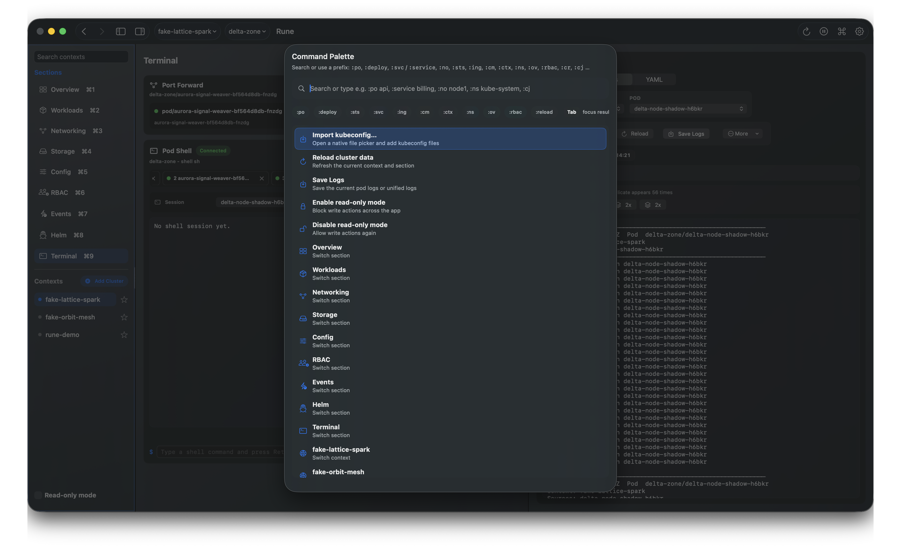

# Rune

Rune is a fast native macOS Kubernetes cluster manager for people who debug real clusters every day.

It is built for fast Kubernetes troubleshooting: quick navigation, strong keyboard support, direct access to resources, and no heavy platform console in the way. Rune adds a native macOS interface with more room for logs, YAML, describe output, port-forwarding, metrics, events, and focused troubleshooting without turning into bloat.



## Why Rune

Kubernetes debugging is often about keeping enough context in view: the pod, its controller, related service, current YAML, recent events, and the logs that actually contain the error. Rune keeps those workflows close together.

- Browse contexts, namespaces, workloads, networking, storage, config, RBAC, events, Helm releases, and a terminal view.
- Inspect full pod logs and unified logs across related workloads.
- Search through multi-pod logs without constantly changing log limits or jumping between panes.
- Save full logs as `.log`, choose a pod container when needed, multi-select pods for bulk log/YAML ZIP export, copy all logs, or copy selected log lines.
- Edit YAML with syntax highlighting plus validation feedback for errors and warnings.
- Apply YAML with a server dry-run before the write, plus a diff preview and copyable `kubectl` command.
- Port-forward pods and services from the resource you are already inspecting.
- Open exec and terminal workflows in context.
- Check pod and node metrics when your cluster exposes metrics.
- Move quickly with a command palette and k9s-style resource jumps.
- Enter namespaces manually and favorite namespaces per context when RBAC prevents listing namespaces.
- Add clusters with zero-config kubeconfig discovery, paste/file/folder import, manual token kubeconfig, or guided EKS, AKS, and GKE cloud import.
- Run Auth Doctor to check kubeconfig, context, namespace, pod/log/exec/port-forward permissions, and API transport.
- Load a small in-memory demo cluster from the Rune menu without starting a server.
- Stay local: Rune does not use analytics, tracking, advertising, or telemetry.

## Screenshots

### Featured

[Jump to the full screenshot grid](#full-screenshot-grid).

<p>
  
</p>

<p>
  
</p>

## Navigation

- **Main sections:** use the sidebar or **Cmd+1** through **Cmd+9**: Overview, Workloads, Networking, Storage, Config, RBAC, Events, Helm, and Terminal.
- **Toolbar:** choose the Kubernetes context and namespace for the data you browse.
- **Manual namespace:** choose **Enter Namespace...** from the namespace menu, or type `:ns <name>` in the command palette when namespace listing is blocked by RBAC.
- **Namespace favorites:** favorite the current namespace from the namespace menu; favorites sort first per context.
- **History:** use **Cmd+Option+Left Arrow** and **Cmd+Option+Right Arrow** to move back and forward in the navigation stack.
- **Reload:** use **Cmd+R** to refresh the current view.
- **Live state:** the overview banner shows whether the current snapshot is live, refreshing, stale, failed, or not loaded yet.

## Command Palette

Open the palette with **Cmd+K**, or click the **Palette** button in the toolbar. Search by free text across contexts, namespaces, resources, and actions, or type a `:` prefix to run command-style jumps.

- **Syntax:** `:command` or `:command filter`, for example `:po api`, `:svc billing`, or `:ns kube-system`.
- **Cluster and scope:** `:ctx` switches context and `:ns` switches namespace.
- **Workloads:** `:po` / `:pod`, `:deploy`, `:sts`, `:ds`, and `:wl`.
- **Networking:** `:svc` / `:service` / `:services`, `:ing`, and `:net`.
- **Configuration:** `:cm`, `:sec`, and `:cfg`.
- **RBAC:** `:rbac`, `:role`, `:rb`, `:cr`, and `:crb`.
- **Helm:** `:helm` / `:hr` opens Helm releases and can filter by release name.
- **More:** `:ev`, `:reload`, `:import`, `:ro`, and `:readonly`.

Type `:` by itself to see the built-in command cheat sheet.

## Logs

Rune treats logs as a primary workflow, not a side panel. Pod logs and unified service/deployment logs support search, time presets, previous logs, tail mode, stable text selection, pod container selection, `.log` export, ZIP export, selected-pod ZIP export, copy selected lines, and copy all.

ZIP exports include a merged log file plus one file per pod when Rune can split prefixed unified logs.

## Safety

Rune blocks writes in read-only mode, warns when a production-like context is active, records write audit entries, shows YAML diffs before apply, runs server dry-run validation before applying YAML, and exposes a copyable `kubectl` command in write confirmations.

## Auth Doctor and Demo

Run **Rune > Run Auth Doctor** to check the active kubeconfig path, context list, context namespace, namespace listing, API transport, pod listing, pod logs, pod exec permission, and pod port-forward permission. Auth Doctor does not start exec shells or port-forward sessions.

Run **Rune > Load Demo Cluster** to explore Rune with a small in-memory cluster. It does not start a background server or contact a Kubernetes API. The action can be disabled in Settings.

## Privacy

Rune does not collect personal data or usage data. It does not use analytics, tracking, advertising, or telemetry, and it does not send your cluster data to a Rune backend.

The only network traffic is the traffic required for Rune to communicate with the Kubernetes clusters and services you choose to connect to. Kubeconfig files, cluster endpoints, credentials, Keychain items, and security-scoped bookmarks are handled locally on your Mac.

See [PRIVACY.md](PRIVACY.md) for the full privacy policy.

## Requirements

- macOS 14 or later
- Swift 6, for example via Xcode
- Rune talks to Kubernetes through its native in-app Kubernetes client.

## Build and Run

```bash
swift build
swift run RuneApp
```

Release build:

```bash
swift build -c release --product RuneApp
```

## App Bundle

```bash
./scripts/build-macos-app.sh
```

Produces `dist/Rune.app`.

## Development

```bash
swift test
```

## License

Rune is source-available. Personal and other non-commercial use is free.
Business use requires a paid commercial license or an authorized Mac App Store
purchase. See [LICENSE](LICENSE).

## Support Rune

If you want to support Rune development, buy the app on the Mac App Store:

- [Buy RuneApp on the Mac App Store](https://apps.apple.com/us/app/runeapp/id6762515322?mt=12)

You can also support development through PayPal:

- [☕ Send 1 USD](https://paypal.me/viktornyberg1/1USD)
- [🍺 Send 2.99 USD](https://paypal.me/viktornyberg1/2.99USD)
- [🍻 Send 4.99 USD](https://paypal.me/viktornyberg1/4.99USD)

<a id="full-screenshot-grid"></a>

## Full Screenshot Grid

<p>
  
  
</p>

<p>
  
  
</p>

<p>
  
  
</p>

<p>
  
  
</p>

<p>
  
  
</p>
